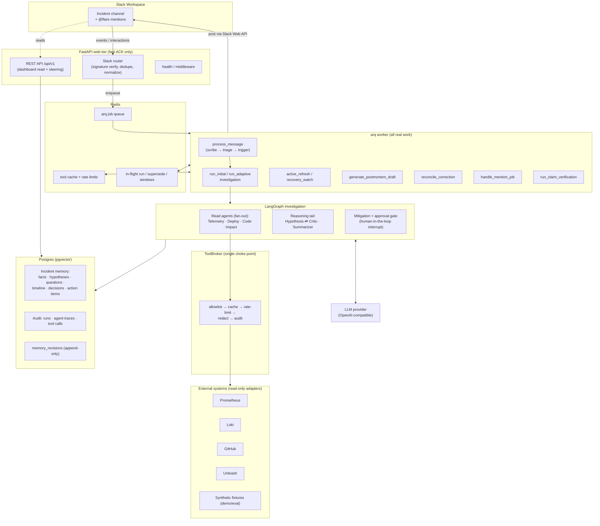
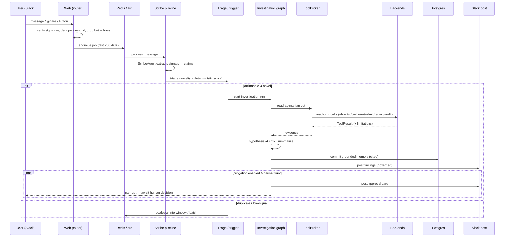
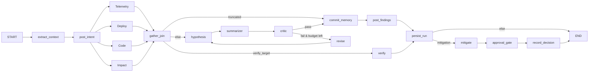
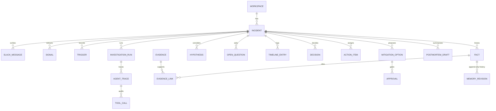

# Flare — Design & Architecture

Flare is an AI incident copilot that lives in a Slack channel. It reads an incident's channel messages and real telemetry, investigates, keeps a grounded and cited memory of what is known, proposes mitigations, and drafts a postmortem all under human authority.

This document describes the system's shape, the data model, the runtime flow,
and the design decisions and trade-offs behind them.

---

## 1. Design goals & non-goals

**Goals**

- **Grounded.** Every fact the copilot asserts traces to evidence
  from a real read. Uncited model prose is dropped, not published.
- **Read-only by construction.** The copilot can look at anything and change
  nothing. Mutation is structurally impossible, not merely discouraged.
- **Human authority is absolute.** A human decision is never silently
  overwritten by an agent. Mitigations are proposals gated on approval.
- **Honest degradation.** A failed read produces an explicit stated gap, not a
  confident guess or a crash.
- **Auditable.** Every tool call, agent step, token spend, and memory change is
  recorded and replayable.
- **Provider-agnostic reasoning.** The LLM backend is swappable; no single
  vendor is load-bearing.

**Non-goals**

- Flare does not take remediation actions. It surfaces options; humans act.
- Flare is not a metrics store or a pager, it reads from those systems.
- Flare does not replace the incident commander; it is an aide.

---

## 2. Component architecture

Flare is a FastAPI web app plus an [arq](https://arq-docs.helpmanual.io/) Redis
worker. Slack traffic hits the web tier, which verifies and ACKs fast, then
hands all real work to the worker. A Next.js dashboard reads the audit trail
over a versioned REST API.

### Module map

| Package | Responsibility |
|---|---|
| `flare/api` | Versioned REST for the dashboard + steering; error handlers, request-id middleware |
| `flare/slack` | Signature verify, event/interaction routing, dedupe, block-kit rendering, posting |
| `flare/worker` | arq queue wiring (`enqueue`, `settings`) — the only place jobs are declared |
| `flare/pipeline` | Job bodies: scribe (`messages`), `triage`, `investigation`, `adaptive`, `active`, `postmortem`, `correction`, `mention`, `verification` |
| `flare/agents` | The LLM agents: planner, trigger, scribe, read agents, hypothesis, critic, summarizer, mitigation, verifier, postmortem, reconciler |
| `flare/investigation` | LangGraph assembly (`graph`), run recorder, state, commit, resume |
| `flare/adaptive` | Trigger scoring, novelty, anti-spam governor, supersede, coalescing windows |
| `flare/tools` | `ToolBroker`, read-only interface/contract, backend adapters (`real`, `synthetic`) |
| `flare/memory` | Grounded memory repository, human-authority guard, revision log |
| `flare/llm` | Provider-agnostic OpenAI-compatible client, redaction, token estimation, parsing |
| `flare/postmortem` | Postmortem generation service |
| `flare/active` | Active-mode scheduler + recovery watcher |
| `flare/budgets` | Per-run and per-incident token/tool budgets |
| `flare/retention` | Export, erasure (tombstones), retention |
| `flare/events` | Transactional outbox for post-commit side effects |
| `flare/models` | SQLAlchemy models: core, ingestion, claims, provenance, tracing, audit |
| `dashboard/` | Next.js read UI over `/api/v1` |

---

## 3. End-to-end flow

The critical discipline: the web tier does no LLM or backend work. It
verifies, dedupes, and enqueues within Slack's 3-second budget; everything
expensive runs on the worker.

---

## 4. The investigation graph

The investigation is a compiled LangGraph state machine (`flare/investigation/graph.py`).

Key properties:

- **Read agents fan out concurrently** (bounded by a semaphore) and each writes
  its own audit trace. An empty selection still runs the reasoning tail, so a
  planner that picks no reads degrades to "re-reason over existing evidence"
  rather than producing a broken graph.
- **Hypothesis ⇄ Critic is a bounded loop.** The critic's objections feed back
  into the next hypothesis prompt — that feedback is what makes the retry
  differ. If the budget for revisions is exhausted, memory is committed anyway
  with the critic's unmet objections recorded as limitations.
- **`verify` is a separate branch** for the `@flare validate <claim>` path: it
  judges one claim against fresh evidence and skips hypothesis/mitigation.
- **Mitigation is proposal-only** and ends in a LangGraph `interrupt` — the run
  suspends until a human approves/rejects, and the decision is recorded as
  intent, never applied.
- **Checkpoints between nodes** abort the run if it has been superseded by
  newer context (see §7).

---

## 5. Data model

Everything the copilot "knows" is a row with provenance. Claim tables share a
`ProvenanceMixin` envelope: `kind` (fact / hypothesis / inference /
human_statement), `confidence`, `source`, `created_by`, `last_verified_at`,
`superseded_by`, and a pgvector `embedding`.

Three layers:

1. **Ingestion** — `slack_messages`, `signals`, `triggers`: the raw stream and
   what triage made of it.
2. **Memory** (the grounded picture) — `facts`, `hypotheses`, `open_questions`,
   `timeline_entries`, `decisions`, `action_items`, `mitigation_options`,
   `postmortem_drafts`, `summaries`, plus `evidence` and the
   `evidence_links` join that ties every claim to what supports it.
3. **Audit** — `investigation_runs`, `agent_traces`, `tool_calls` (full
   read-only trace), `memory_revisions` (append-only change log with actor),
   `approvals`, and `data_erasures` (deletion tombstones).

`memory_revisions` is append-only and records the **actor** (`user:<id>` for
humans, agent name otherwise). This is what makes human authority enforceable:
the guard can ask "which fields did a human already decide?" and refuse to let
an agent overwrite them.

---

## 6. Safety architecture — read-only by construction

Rather than trusting prompts to keep agents from taking actions, read-only is
enforced structurally at the broker boundary:

- Adapters must satisfy the `ReadOnlyTool` protocol: a `spec`, a `system`, and a
  single async `read()`. There is no write path in the interface.
- On registration the broker rejects any adapter exposing a method whose name
  looks mutating (`write`, `delete`, `apply`, `rollback`, `deploy`, `scale`,
  `send`, … — a broad denylist). Adding a mutating capability would require
  changing the protocol itself.
- Every call flows through one choke point: **allowlist → cache → rate-limit →
  redact → audit**. Tool args and results are redacted before they are hashed,
  cached, or persisted, and every call writes a `tool_calls` row with
  `read_only=True`, latency, status, and redaction counts.
- **Cache keys include the incident id and a provider fingerprint** so one
  incident can never read another's cached results, and a fixture result can't
  masquerade as a live one.
- **Tool args are service-shaped** (`service=`, `metric=p99_ms`), never
  backend-shaped (`promql=`). This keeps the provider seam honest — swapping
  Prometheus for something else can't leak query syntax to the agent.

---

## 7. Concurrency, coalescing & supersede

Incidents are bursty: ten messages can land while one investigation runs. Flare
handles this with Redis-backed coordination in `flare/adaptive`:

- **Triage** scores each message (deterministic score + novelty vs. existing
  memory). Low-signal or duplicate messages don't trigger a run.
- **Coalescing windows** batch a flurry of messages into one run's seed context
  instead of firing a run per message.
- **Supersede**: a newer, more relevant run marks the in-flight run superseded.
  The running graph checks a cancellation predicate at each node checkpoint and
  aborts cleanly (`RunSuperseded`) rather than committing stale conclusions.
- **Anti-spam governor**: near-duplicate Slack posts are suppressed via Jaccard
  similarity so the channel isn't flooded with restatements.

---

## 8. Grounding & human authority

- **Grounding**: the postmortem/summary root cause is chosen by code, not the
  model — human-confirmed claims beat best-supported claims, and uncited model
  prose is dropped with the drop disclosed. A claim with no evidence link does
  not get asserted.
- **Human authority guard** (`flare/memory/authority.py`): before an agent
  writes a field, the guard checks `memory_revisions` for a human edit to that
  field. Human-decided fields are locked. Statements a human explicitly
  rejected are matched by word-set Jaccard so the model can't relitigate a
  rejected claim by rewording it.
- **Approvals**: mitigations that could change the world are gated behind an
  `approvals` row and a Slack card; the graph interrupts until a human decides.

---

## 9. Exactly-once side effects

Two mechanisms keep external effects from doubling under retries:

- **Transactional outbox** (`flare/events/outbox.py`): events are queued on the
  session and only published after the DB transaction commits; a rollback
  discards them. A side effect never fires for a write that didn't land.
- **Redis NX tokens** for one-shot posts (e.g. recovery announcements): the
  governor's dedup only backstops the message; the NX token is the real
  exactly-once guarantee, and tests assert the refusal reason.

---

## 10. Observability & cost control

- Every run is an `investigation_runs` row; every agent step an `agent_traces`
  row; every read a `tool_calls` row. The dashboard renders this trace directly.
- **Token budgets** are enforced per-run and per-incident. Providers that don't
  report usage get estimated tokens flagged `estimated: true`, because
  counting zero would silently disable the budget.
- **Degradation counters** (schema repairs, capability downgrades, 429 backoff)
  are tracked separately so a rejected parameter can't eat a repair attempt's
  budget.

---

## 11. Key decisions & trade-offs

| Decision | Rationale | Trade-off accepted |
|---|---|---|
| **Web tier only ACKs; worker does all work** | Slack's 3s deadline; keep request path cheap and reliable | Added Redis/arq operational surface; work is async, so users see results a beat later |
| **Read-only enforced by construction** (protocol + denylist at registration) | Prompt-level guardrails are bypassable; structural safety isn't | A legitimately-named read method could trip the denylist; adding real mutation is deliberately hard |
| **Single audited ToolBroker choke point** | One place for allowlist, cache, rate-limit, redaction, audit — no adapter can bypass it | All reads pay the broker's overhead; adapters can't do bespoke caching |
| **Service-shaped tool args, not backend-shaped** | Keeps the provider seam real; lets backends swap without leaking query syntax | Adapters must translate service concepts to backend queries themselves |
| **Grounding decided in code, not by the model** | Uncited prose is the main failure mode of LLM incident tools | The copilot sometimes says less than it "could"; disclosed drops can read as terse |
| **Human authority as an append-only revision log** | Makes "never overwrite a human" checkable, not aspirational | Every write consults revision history; more query cost per commit |
| **Mitigations are proposals gated on approval interrupt** | The blast radius of a wrong action is unbounded; humans must decide | Flare can't auto-remediate even trivial, reversible fixes |
| **LangGraph with checkpoint + interrupt** | Native fan-out, human-in-the-loop suspend/resume, per-node cancellation | Graph wiring is intricate; superseding logic must be threaded through every node |
| **Coalescing + supersede over run-per-message** | Incident channels are bursty; stale conclusions are worse than late ones | A superseded run's partial work is discarded; some latency before a run "settles" |
| **Provider-agnostic OpenAI-compatible client** | No single LLM vendor should be load-bearing; capabilities learned per (endpoint, model) | Must handle each provider's quirks (missing usage, 400 on params) with degrade-and-retry |
| **Transactional outbox + Redis NX for effects** | Retries must not double-post or double-announce | Two mechanisms to reason about; effects lag the commit slightly |
| **Postgres + pgvector as the one store** | Relational audit trail and semantic memory in one system; simpler ops | pgvector isn't a specialized vector DB; fine at incident scale, not web scale |

---

## 12. Running the system

- `make up` — Postgres (pgvector) + Redis via compose.
- `make run` — the FastAPI app (`main.py`).
- `make worker` — the arq worker (`flare.worker.settings.WorkerSettings`).
- `make lint` / `make typecheck` — ruff + mypy.
- Migrations live in `alembic/versions`; the dashboard is a separate Next.js app
  under `dashboard/` reading `/api/v1`.

Configuration is environment-driven via pydantic settings (`flare/config.py`),
grouped by concern (slack, llm, tools, budgets, adaptive, governor, mitigation,
active, recovery). Secrets are resolved through `flare/secrets.py`.
